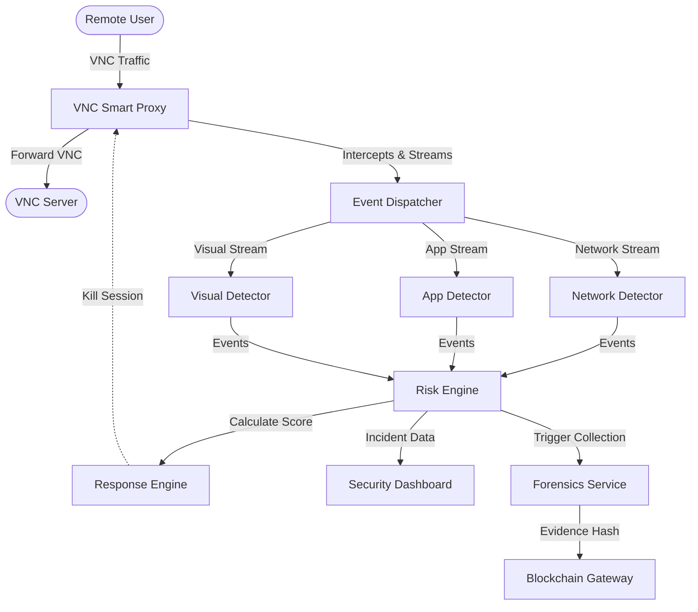

<div align="center">
  <h1>🛡️ SentinelVNC</h1>
  <p><strong>Intelligent Defense & Data Exfiltration Protection for Remote Access Infrastructure</strong></p>
</div>

---

## 📖 Overview

In today's interconnected world, Virtual Network Computing (VNC) servers are essential for remote administration but present significant security blind spots. Traditional firewalls treat VNC traffic as a black box, unable to differentiate between an administrator executing routine commands and an attacker exfiltrating sensitive data.

**SentinelVNC** is an intelligent middleware—a "Smart Proxy"—that sits transparently between the user and the server. It performs real-time Deep Protocol Inspection of the RFB (Remote Framebuffer) protocol to detect data exfiltration attempts (Clipboard, File Transfer, Visual) without breaking encryption for the end-user.

## ✨ Key Features

- **Deep Protocol Inspection:** Parses the RFB protocol in real-time, distinguishing between a mouse move, a keypress, a file transfer, and a clipboard paste.
- **Multi-Vector Detection Engine:**
  - **App Detector:** Analyzes clipboard text for sensitive data (PII, API Keys) using Regex patterns.
  - **Network Detector:** Employs Shannon Entropy on traffic bursts to detect encrypted or compressed file smuggling.
  - **Visual Detector:** Monitors screen update rates to catch rapid "Screenshot Bursts" (manual exfiltration).
- **AI & Behavioral Analysis:** Uses **Isolation Forests** (Unsupervised ML) to learn user baselines and flag anomalous behavior.
- **Dynamic Risk Scoring:** Real-time evaluation of risk (0-100) determining the severity of intercepted events.
- **Automated Response:** Triggers immediate actions such as `kill_session` for critical risk, `deceive` (honeypot redirection) for medium risk, or `allow` for safe interactions.
- **Immutable Forensics:** Incident hashes are anchored to the **Ethereum Sepolia Testnet** using a Merkle Tree, guaranteeing mathematically tamper-proof evidence.

## 🏗️ Architecture

SentinelVNC implements a 4-layer defense architecture, coordinating across specialized microservices:



## 📂 Project Structure

```text
SentinelVNC/
├── proxy/             # VNC proxy interception & stream splitting
├── detectors/         # Specialized threat detection modules
│   ├── app/           # Clipboard and App-level anomaly detection
│   ├── network/       # Entropy analysis & file transfer detection
│   ├── visual/        # Screen-capture burst detection
│   └── dispatcher.py  # Routes proxy streams to correct detectors
├── risk_engine/       # Consolidates events & calculates dynamic risk
├── response_engine/   # Orchestrates automated mitigation (kill/deceive/allow)
├── forensics/         # Evidence collection and hashing
├── blockchain/        # Anchors forensic evidence to Ethereum Sepolia Testnet
├── dashboard/         # React-based SOC dashboard for real-time monitoring
└── scripts/           # Demo attack simulators and utilities
```

## 🚀 Quick Start & Demo

### Prerequisites

- Python 3.10+
- Node.js (for React Dashboard and Proxy)
- PowerShell or Bash environment
- Dependencies specified in `requirements.txt` or `package.json` for respective modules.

### Running the End-to-End Demo

The fastest way to test the system is to run our automated demo script, which starts all microservices and simulates data exfiltration attacks.

**Using PowerShell (Windows):**
```powershell
.\DEMO_RUN.ps1
```

**What happens during the demo?**
1. **Service Initialization:** Spins up all 8 microservices (Proxy, Dispatcher, 3x Detectors, Risk Engine, Response Engine, Forensics, Blockchain) and the Web Dashboard.
2. **Attack Simulation:** Runs `scripts/demo_attack_simulator.py` to emulate various exfiltration behaviors (e.g., rapid clipboard copy, file transfer burst).
3. **Detection & Mitigation:** The platform calculates the risk, creates an incident, logs it transparently, and automatically neutralizes the threat.
4. **Dashboard View:** Opens `http://localhost:3000` for you to review the correlated events, calculated risk score, and the generated blockchain hash of the incident.

### Starting Services Manually

If you prefer to start components individually for development, refer to the port mappings below:

| Service | Port | Health Check |
|---------|------|--------------|
| Dispatcher | `8000` | `/health` |
| Network Detector | `8001` | `/health` |
| App Detector | `8002` | `/health` |
| Visual Detector | `8003` | `/health` |
| Risk Engine | `9000` | `/health` |
| Response Engine | `9200` | `/health` |
| Forensics | `9100` | `/health` |
| Blockchain Gateway | `8080` | `/health` |
| React Dashboard | `3000` | `http://localhost:3000` |

*See `DEMO_SETUP.md` for specific startup commands and deeper troubleshooting instructions.*

## 🛡️ License

This project is licensed under the MIT License - see the LICENSE file for details.
